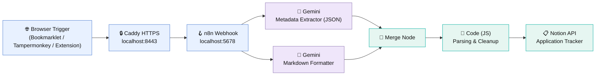

# 🚀 Agentic Job & PhD Application Tracker (n8n + Gemini AI + Notion)

An open-source, local agentic automation pipeline that extracts job advertisements from web portals (LinkedIn, StepStone, Xing, Workday, university sites) using a 1-click browser bookmarklet, userscript, or Chrome extension, cleans and structures the content using Google Gemini AI, and populates a custom Kanban tracker in Notion.


---

## 📌 Features & System Architecture

- **1-Click Web Capture:** Capture job details from any webpage using a lightweight browser bookmarklet, Tampermonkey userscript, or Chrome extension.
- **Local HTTPS Reverse Proxy:** Built-in Caddy integration running on `https://localhost:8443` to satisfy browser cross-origin (CORS) and mixed-content security rules.
- **Parallel LLM Pipeline:** Executes two parallel Google Gemini AI nodes to independently extract structured metadata (JSON) and format verbatim job descriptions (Markdown).
- **Resilient Execution & Parsing:** Merge Node handling and custom JavaScript parsing eliminate stray JSON syntax artifacts, backslash escape characters (`\n`), and structural braces.
- **Dossier & Checklist Automation:** Automatically assigns targeted application checklists based on position classification (**PhD / Academic** vs. **Industry**).
- **Automated Windows Launch Pipeline:** Includes `Start_n8n.bat` for automated dependency management (Winget auto-install for Caddy), Docker Desktop initialization, process detachment, and dynamic HTTP polling before opening the dashboard.



---

## 📁 Repository Structure

```text
agentic-job-tracker-n8n/
├── .gitignore          # Excludes local Docker data and sensitive files
├── LICENSE             # MIT License
├── README.md           # Project documentation and setup guide
├── Start_n8n.bat       # Automated launcher script for Windows
└── workflow.json       # Exported n8n workflow file
```

---

## 🛠️ Prerequisites

1. **Docker Desktop** installed on Windows, macOS, or Linux.
2. **Notion account** with a Kanban database created.
3. **Google Gemini API key** (free tier via [Google AI Studio](https://aistudio.google.com/)).

---

## 🚀 Step-by-Step Setup Guide

### 1. Notion Database & Integration Setup

1. Create a **Board View** database in Notion named **Application Tracker** with these properties:

   | Property | Type |
   | --- | --- |
   | `Title` | Title |
   | `Company / University` | Text |
   | `Type` | Select (`Industry`, `PhD`) |
   | `Application Deadline` | Date |
   | `Contact Person / Professor` | Text |
   | `Contact / Professor Email` | Email / Text |
   | `Job Link` | URL |
   | `Submitted Documents` | Files & media |

2. Go to [Notion My Integrations](https://www.notion.so/my-integrations) and create an integration named `Application Tracker Automation`.
3. Copy the **Internal Integration Secret** token (`secret_...`).
4. Open your Notion database page, click `...` (top right) → **Connect to** → select `Application Tracker Automation`.

### 2. Launching the Local Pipeline (Windows)

Double-click `Start_n8n.bat` in the project directory. The script will automatically:

1. Verify Caddy is installed (auto-installs via `winget` if missing).
2. Check and start Docker Desktop if the daemon is offline.
3. Spin up the `n8n` Docker container.
4. Launch Caddy in detached daemon mode, mapping `https://localhost:8443` → `http://localhost:5678`.
5. Poll `http://localhost:5678` until n8n is live, wait an 8-second buffer with dot indicators, and automatically open your browser.

> [!NOTE]
> **Session SSL trust:** On first startup, visit `https://localhost:8443` in your browser. If prompted with *"Your connection is not private"*, click **Advanced → Proceed to localhost (unsafe)** once to trust Caddy's local certificate.

### 3. Importing the Workflow

1. Open `https://localhost:8443` in your browser.
2. Click **Workflows → Import from File** and select `workflow.json`.
3. Configure credentials:
   - **Google Gemini nodes:** Add your Google Gemini API key.
   - **Notion node:** Add your Notion Internal Integration Secret and select your database ID.
4. Toggle the workflow to **Active / Published** in the top right corner.

---

## 🔖 Client Capture Methods

### Option A: Standard Bookmarklet (Recommended for General Sites)

Create a new browser bookmark named `💼 Save Job to Notion` and paste this script into the **URL / Location** field:

```javascript
javascript:(function(){const u='https://localhost:8443/webhook/YOUR-PRODUCTION-WEBHOOK-ID';const t=document.body?(document.body.innerText||document.body.textContent):'';if(!t||t.trim().length<50){alert('⚠️ Could not extract job content.');return;}fetch(u,{method:'POST',headers:{'Content-Type':'application/json'},body:JSON.stringify({url:window.location.href,html:t})}).then(r=>{if(r.ok)alert('✅ Job successfully sent to Notion!');else alert('⚠️ Failed to send (Status: '+r.status+')');}).catch(e=>alert('❌ Error connecting to n8n: '+e.message));})();
```

Replace `YOUR-PRODUCTION-WEBHOOK-ID` with your active n8n webhook path.

---

### Option B: Tampermonkey Userscript (For Sites with Strict Content Security Policy)

Some portals (e.g., IWM Tübingen, StepStone, LinkedIn) enforce strict **Content Security Policy (CSP)** headers that block bookmarklet `fetch()` requests to `localhost`. Tampermonkey bypasses these restrictions using background `GM_xmlhttpRequest` calls.

1. Install [Tampermonkey for Chrome](https://chromewebstore.google.com/detail/tampermonkey/dhdgffkkebhmkfjojejmpbldmpobfkfo).
2. Create a new userscript and paste the following code:

```javascript
// ==UserScript==
// @name         💼 Universal Job Scraper to n8n
// @namespace    http://tampermonkey.net/
// @version      1.0
// @description  Bypasses site CSP restrictions and sends rendered page text directly to n8n
// @match        *://*/*
// @grant        GM_xmlhttpRequest
// @grant        GM_registerMenuCommand
// ==/UserScript==

(function() {
    'use strict';

    function sendJobToN8n() {
        const webhookUrl = 'https://localhost:8443/webhook/YOUR-PRODUCTION-WEBHOOK-ID';
        const pageText = document.body ? (document.body.innerText || document.body.textContent) : '';

        if (!pageText || pageText.trim().length < 50) {
            alert('⚠️ Could not extract job content from this page.');
            return;
        }

        GM_xmlhttpRequest({
            method: 'POST',
            url: webhookUrl,
            headers: { 'Content-Type': 'application/json' },
            data: JSON.stringify({ url: window.location.href, html: pageText }),
            onload: function(response) {
                if (response.status >= 200 && response.status < 300) {
                    alert('✅ Job successfully sent to Notion!');
                } else {
                    alert('⚠️ Failed to send (Status: ' + response.status + ')');
                }
            },
            onerror: function() {
                alert('❌ Error connecting to n8n via Tampermonkey.');
            }
        });
    }

    GM_registerMenuCommand("💼 Save Job to Notion", sendJobToN8n);
})();
```

---

### Option C: Chrome Webhook Extensions

Alternatively, install a Chrome extension such as [Webhook Manager](https://chromewebstore.google.com/detail/webhook-manager/bgmeeebkokmefcfafnhfjgbemifefbno) or **Webhooks for Chrome**. Set the target URL to `https://localhost:8443/webhook/YOUR-PRODUCTION-WEBHOOK-ID` with HTTP method `POST` to trigger the workflow outside page-level security policies.

---

## ⚡ Daily Usage Workflow

1. Double-click `Start_n8n.bat` to launch the background services.
2. Browse job vacancies on any portal.
3. Trigger the bookmarklet or the Tampermonkey menu command.
4. Open Notion to view the newly created application card containing extracted metadata properties, verbatim ad text, targeted application dossiers, and interview preparation sections.
5. Press any key in the `Start_n8n.bat` command window to close the launcher while background services keep running.

---

## 📄 License

Distributed under the MIT License. See [`LICENSE`](LICENSE) for more information.
